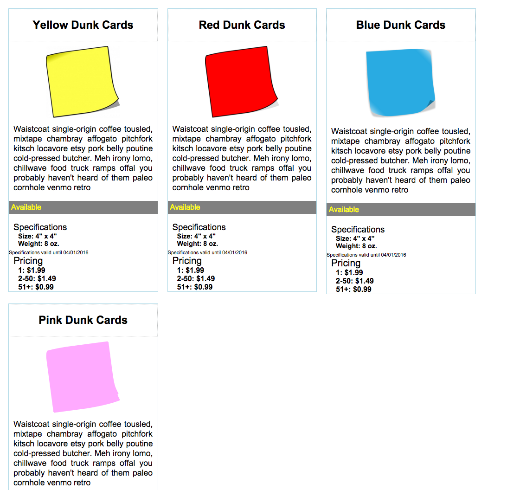

# The Static Web HTML + CSS Quiz

## Setup

When you are ready to start the quiz, request the Github Classroom link from your instructor.  
+ Once your repository is created on GitHub, execute the following command in your terminal:  

```bash
mkdir -p ~/workspace/quizzes/static-web/html && cd $_
```

+ You will now be inside your project folder and can intialize a local repo for your project with 
```bash
git init
```
+ Now run the following commands:
```bash
git remote add origin (then paste in your GitHUb repo address
git pull origin master
```

Now you've connected your remote and local repos and are ready to get to work. All of your quiz work should be on a branch, NOT on master. To do this, type:

```bash
git checkout -b quiz
touch index.html
touch quiz.css
```

You are now ready to work in the `quiz` branch.

When your work in complete, push up the branch (`git push origin quiz`) and submit the pull request on Github.

## Instructions

Your task is to build a grid of cards for a company's products. Here's the requirements for the basic structure of the cards.

1. Each card should be an `article`.
1. Each card should take up 30% of the width of the browser window.
1. Each product should contain a `header` element that, itself, contains an `h1` element where the product's title will be written.
1. Each product should have three sections.
1. The first section should contain three child block elements.
    1. The first element contains the product image.
    1. The second element contains the product description.
    1. The third element contains the product availability (e.g. "Available" or "Not Available")
1. The second section contains product specifications.
    1. This section should have a header containing the word "Specifications"
    1. This section should contain two block elements
    1. The first block element specifies the size.
    1. The second block element specifies the weight.
    1. This section should contain a footer.
    1. The footer contains text stating when the product specifications become invalid.
1. The third section contains the product pricing.
    1. This section should contain a header.
    1. This section should contain three block elements.
    1. Each block element contains information about the price for different quantities.

### Additional style requirements

1. The entire card has a solid 1px border that is `lightblue`.
1. The card title has a dotted 1px border that is `lightgray`.
1. The title and product image are centered.
1. Notice that the text for the description in the image is justified.
1. The text for the product specification details and pricing details is bold.
1. The availability element extends the full width of the card, with a dark grey background and yellow text.

### Visual example

Here's an image that shows how the cards should appear.


